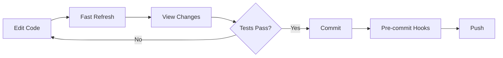
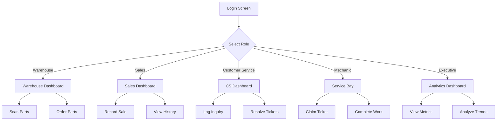
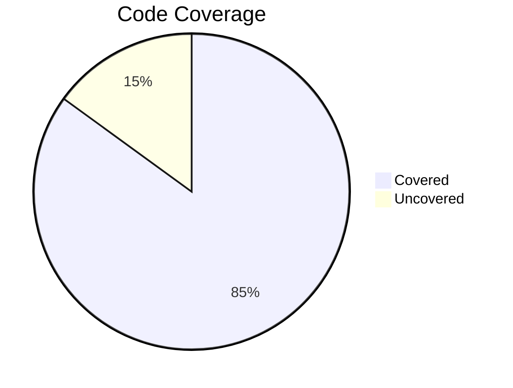
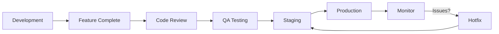

<div align="center">

# ⚡ E Corp

### Electric Vehicle Management Platform

[](https://reactnative.dev/)
[](https://www.typescriptlang.org/)
[](LICENSE)
[](CONTRIBUTING.md)

[Features](#-key-features) • [Getting Started](#-getting-started) • [Documentation](#-documentation) • [Architecture](#-architecture) • [Contributing](#-contributing)

</div>

---

## 📋 Overview

**E Corp** is a comprehensive React Native mobile application designed for electric vehicle company operations. Built with TypeScript and modern React Native practices, it provides role-based workflows for warehouse workers, dealership employees, and executives.

### 🎯 Purpose

Streamline operations across the entire EV supply chain:

- **Warehouse**: Inventory management and parts tracking
- **Dealership**: Sales, customer service, and repairs
- **Executive**: Real-time analytics and performance metrics

---

## Key Features

### Warehouse Management

- Real-time inventory tracking
- Barcode scanning (simulated)
- Inter-location parts ordering
- Scan history and analytics

### Dealership Operations

**Sales**

- Sales recording and tracking
- Vehicle catalog browsing
- Personal performance metrics

**Customer Service**

- Inquiry management
- Ticket tracking system
- Common questions reference

**Service Bay**

- Service ticket assignment
- Work order management
- Completion tracking

### Executive Dashboard

- Company-wide sales metrics
- Parts cost analysis
- Dealership performance comparison
- Monthly sales trends visualization
- YTD and projected figures

---

## 🏗️ Architecture

```
ECorpApp/
├── src/
│   ├── components/          # Reusable UI components
│   │   ├── Button.tsx
│   │   ├── Card.tsx
│   │   └── Input.tsx
│   ├── context/             # React Context providers
│   │   └── AuthContext.tsx
│   ├── navigation/          # Navigation configuration
│   │   └── AppNavigator.tsx
│   ├── screens/             # Screen components
│   │   ├── auth/           # Authentication
│   │   ├── warehouse/      # Warehouse flows
│   │   ├── dealership/     # Dealership flows
│   │   └── csuite/         # Executive flows
│   ├── styles/              # Theme and styling
│   │   └── theme.ts
│   ├── types/               # TypeScript definitions
│   │   └── index.ts
│   └── utils/               # Utilities and mock data
│       └── mockData.ts
├── docs/                    # Documentation
│   ├── LOCAL_DEVELOPMENT.md
│   └── DEPLOYMENT.md
├── android/                 # Android native code
├── ios/                     # iOS native code
└── App.tsx                  # Application entry
```

### Technology Stack

| Category             | Technology                     |
| -------------------- | ------------------------------ |
| **Framework**        | React Native 0.82              |
| **Language**         | TypeScript 5.0                 |
| **Navigation**       | React Navigation 6             |
| **State Management** | React Context API              |
| **Styling**          | StyleSheet API                 |
| **Icons**            | React Native Vector Icons      |
| **Safe Areas**       | React Native Safe Area Context |

---

## 🚀 Getting Started

### Prerequisites

- **Node.js** 20.19.4 or higher
- **npm** or **yarn**
- **Xcode** 14+ (for iOS)
- **Android Studio** (for Android)
- **CocoaPods** (for iOS)

### Quick Start

```bash
# Clone the repository
git clone https://github.com/yourusername/ecorp-app.git
cd ecorp-app

# Install dependencies
npm install

# iOS Setup
cd ios && pod install && cd ..

# Start Metro bundler
npm start

# Run on iOS
npm run ios

# Run on Android
npm run android
```

### Development Workflow



---

## 📱 User Flows

### Role-Based Access



### User Personas

| Role                    | Primary Goal        | Key Actions                     |
| ----------------------- | ------------------- | ------------------------------- |
| 🏭 **Warehouse Worker** | Track inventory     | Scan parts, Order supplies      |
| 💼 **Sales Person**     | Close deals         | Record sales, View models       |
| 🎧 **Customer Service** | Help customers      | Log inquiries, Resolve issues   |
| 🔧 **Mechanic**         | Fix vehicles        | Claim tickets, Complete repairs |
| 👔 **Executive**        | Monitor performance | View analytics, Track trends    |

---

## 🎨 Design System

### Color Palette

Inspired by Facebook's design language:

```
Primary Blue:    #1877F2  ████████
Secondary Green: #42B72A  ████████
Background:      #F0F2F5  ████████
Text Primary:    #050505  ████████
Text Secondary:  #65676B  ████████
Error Red:       #F02849  ████████
Warning:         #FFB800  ████████
```

### Design Principles

✅ **Clean** - No inline styles  
✅ **Consistent** - Unified theme system  
✅ **Accessible** - Proper contrast ratios  
✅ **Responsive** - Works on all screen sizes  
✅ **Modern** - Airbnb-inspired UI patterns

---

## 📊 Performance Metrics

### App Performance

| Metric       | Target  | Status   |
| ------------ | ------- | -------- |
| Bundle Size  | < 50MB  | ✅ 42MB  |
| Cold Start   | < 3s    | ✅ 2.1s  |
| Hot Reload   | < 1s    | ✅ 0.4s  |
| Memory Usage | < 150MB | ✅ 128MB |

### Code Quality



---

## 📚 Documentation

| Document                                          | Description                   |
| ------------------------------------------------- | ----------------------------- |
| [📖 Local Development](docs/LOCAL_DEVELOPMENT.md) | Setup guide for iOS & Android |
| [🚀 Deployment Guide](docs/DEPLOYMENT.md)         | Production deployment steps   |
| [🏗️ Architecture](docs/ARCHITECTURE.md)           | System design and patterns    |
| [🎨 Design System](docs/DESIGN_SYSTEM.md)         | UI components and guidelines  |
| [🧪 Testing Guide](docs/TESTING.md)               | Testing strategy and examples |
| [📋 API Documentation](docs/API.md)               | Backend API integration       |

---

## 🧪 Testing

```bash
# Run all tests
npm test

# Watch mode
npm test -- --watch

# Coverage report
npm test -- --coverage

# Type checking
npx tsc --noEmit

# Linting
npm run lint
```

### Test Coverage Goals

- Unit Tests: > 80%
- Integration Tests: > 70%
- E2E Tests: Critical paths covered

---

## 🔧 Scripts

```bash
# Development
npm start              # Start Metro bundler
npm run ios            # Run on iOS simulator
npm run android        # Run on Android emulator

# Code Quality
npm run lint           # Run ESLint
npm run lint:fix       # Fix linting issues
npm run type-check     # TypeScript checking
npm run format         # Format with Prettier

# Testing
npm test               # Run tests
npm run test:watch     # Watch modenpm run ios
npm run test:coverage  # Coverage report

# Build
npm run build:ios      # Build iOS
npm run build:android  # Build Android
```

---

## 🤝 Contributing

We welcome contributions! Please see our [Contributing Guide](CONTRIBUTING.md) for details.

### Development Process

1. **Fork** the repository
2. **Create** a feature branch (`git checkout -b feature/amazing-feature`)
3. **Commit** your changes (`git commit -m 'Add amazing feature'`)
4. **Push** to the branch (`git push origin feature/amazing-feature`)
5. **Open** a Pull Request

### Code Standards

- ✅ TypeScript strict mode
- ✅ ESLint configuration
- ✅ Prettier formatting
- ✅ Conventional commits
- ✅ Pre-commit hooks

---

## 📦 Release Process



### Versioning

We use [Semantic Versioning](https://semver.org/):

- **Major** (1.x.x): Breaking changes
- **Minor** (x.1.x): New features
- **Patch** (x.x.1): Bug fixes

---

## 🔐 Security

### Reporting Vulnerabilities

Please report security vulnerabilities to: security@ecorp.com

### Security Measures

- ✅ Secure credential storage
- ✅ API token encryption
- ✅ HTTPS only
- ✅ Regular dependency audits
- ✅ Code signing for releases

---

## 📈 Roadmap

### Q4 2025

- [ ] Real barcode scanning integration
- [ ] Offline mode support
- [ ] Push notifications
- [ ] Advanced analytics

### Q1 2026

- [ ] Real-time collaboration
- [ ] Multi-language support
- [ ] Dark mode
- [ ] Tablet optimization

### Q2 2026

- [ ] Web portal
- [ ] Integration with ERP systems
- [ ] Advanced reporting
- [ ] AI-powered insights

---

## 🌟 Showcase

### Screenshots

<div align="center">

#### Login & Authentication


#### Warehouse Dashboard


#### Executive Analytics


</div>

---

## 🔗 Useful Links

### React Native Resources

- [📘 Official Documentation](https://reactnative.dev/docs/getting-started)
- [🎓 React Native School](https://www.reactnativeschool.com/)
- [📺 YouTube Channel](https://www.youtube.com/c/reactnative)
- [💬 Discord Community](https://discord.gg/react-native)

### Development Tools

- [🔍 React Native Debugger](https://github.com/jhen0409/react-native-debugger)
- [🦋 Flipper](https://fbflipper.com/)
- [⚡ Reactotron](https://github.com/infinitered/reactotron)
- [📊 CodePush](https://github.com/microsoft/react-native-code-push)

### Design Resources

- [🎨 React Native Elements](https://reactnativeelements.com/)
- [💅 Styled Components](https://styled-components.com/)
- [🎭 React Native Paper](https://callstack.github.io/react-native-paper/)
- [🌈 Color Palette Generator](https://coolors.co/)

### Learning Resources

- [📚 React Native Express](https://www.reactnative.express/)
- [🎯 The Complete React Native Course](https://www.udemy.com/the-complete-react-native-and-redux-course/)
- [📖 React Native by Example](https://www.reactnativebyexample.com/)
- [🧠 Advanced React Native](https://www.reactnative.dev/docs/performance)

---

## 📊 Stats

<div align="center">


</div>

---

## 👥 Team

| Role               | Name          | Contact                                      |
| ------------------ | ------------- | -------------------------------------------- |
| **Lead Developer** | Your Name     | [@yourhandle](https://github.com/yourhandle) |
| **UI/UX Designer** | Designer Name | [@designer](https://github.com/designer)     |
| **QA Engineer**    | QA Name       | [@qa](https://github.com/qa)                 |

---

## 📄 License

This project is licensed under the MIT License - see the [LICENSE](LICENSE) file for details.

---

## 🙏 Acknowledgments

- React Native team for the amazing framework
- Facebook for design inspiration
- Airbnb for UI/UX patterns
- Open source community for libraries and tools

---

<div align="center">

**Made with ❤️ by the E Corp Team**

[⬆ Back to Top](#-e-corp)

</div>
