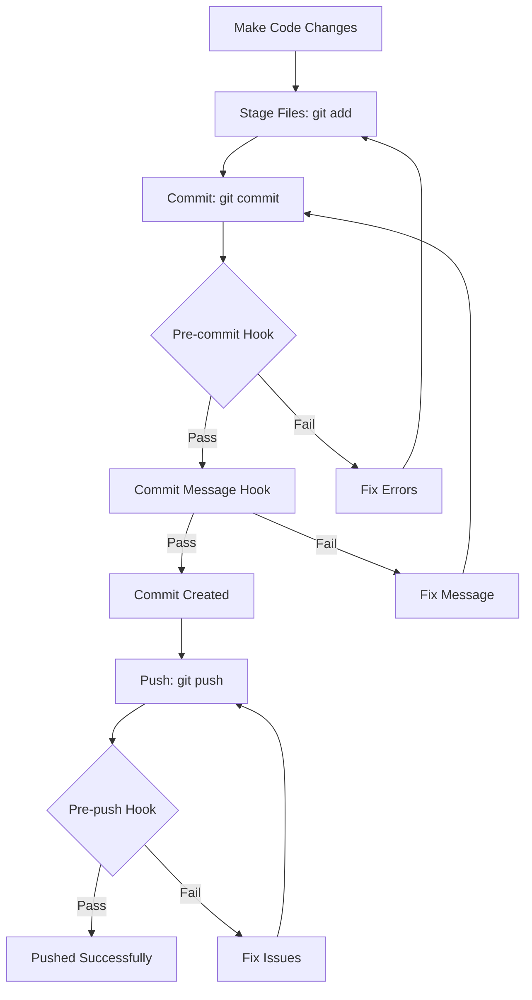

# Code Quality Guide

This document explains the code quality tools and processes configured in the E Corp project.

## Table of Contents

- [Overview](#overview)
- [ESLint](#eslint)
- [Prettier](#prettier)
- [TypeScript](#typescript)
- [Git Hooks](#git-hooks)
- [Commit Message Convention](#commit-message-convention)
- [Pre-Commit Workflow](#pre-commit-workflow)
- [Troubleshooting](#troubleshooting)

---

## Overview

The E Corp project uses multiple tools to maintain code quality and prevent bugs from reaching production:

- **ESLint**: Linting for JavaScript/TypeScript
- **Prettier**: Code formatting
- **TypeScript**: Static type checking
- **Husky**: Git hooks automation
- **Lint-staged**: Run linters on staged files
- **Commitlint**: Enforce commit message conventions

---

## ESLint

### Configuration

ESLint is configured in `.eslintrc.js` with:

- React Native specific rules
- TypeScript support
- React Hooks validation
- Custom code quality rules

### Running ESLint

```bash
# Check for linting errors
npm run lint

# Auto-fix linting errors
npm run lint:fix

# Lint specific file
npx eslint src/components/Button.tsx

# Lint with detailed output
npx eslint . --debug
```

### Key Rules

| Rule                                | Description             | Level   |
| ----------------------------------- | ----------------------- | ------- |
| `react-native/no-inline-styles`     | Prevent inline styles   | Error   |
| `react-native/no-unused-styles`     | Remove unused styles    | Error   |
| `@typescript-eslint/no-unused-vars` | Remove unused variables | Error   |
| `react-hooks/rules-of-hooks`        | Validate Hooks usage    | Error   |
| `react-hooks/exhaustive-deps`       | Check Hook dependencies | Warning |

### Disabling Rules

```typescript
// Disable for single line
// eslint-disable-next-line react-native/no-inline-styles
<View style={{padding: 10}} />;

// Disable for file
/* eslint-disable react-native/no-inline-styles */

// Disable specific rule for block
/* eslint-disable no-console */
console.log('Debug info');
/* eslint-enable no-console */
```

⚠️ **Best Practice**: Avoid disabling rules. Fix the issue instead!

---

## Prettier

### Configuration

Prettier is configured in `.prettierrc.js` with:

- Single quotes
- 2-space indentation
- Trailing commas
- 100 character line width

### Running Prettier

```bash
# Format all files
npm run format

# Check formatting without changing files
npm run format:check

# Format specific files
npx prettier --write src/components/Button.tsx

# Format specific file types
npx prettier --write "src/**/*.{ts,tsx}"
```

### Editor Integration

**VS Code:**

1. Install "Prettier - Code formatter" extension
2. Add to `.vscode/settings.json`:

```json
{
  "editor.defaultFormatter": "esbenp.prettier-vscode",
  "editor.formatOnSave": true,
  "[javascript]": {
    "editor.defaultFormatter": "esbenp.prettier-vscode"
  },
  "[typescript]": {
    "editor.defaultFormatter": "esbenp.prettier-vscode"
  }
}
```

---

## TypeScript

### Type Checking

```bash
# Run type checker
npm run type-check

# Watch mode (continuous type checking)
npx tsc --noEmit --watch

# Check specific file
npx tsc --noEmit src/components/Button.tsx
```

### Configuration

TypeScript is configured in `tsconfig.json` with strict mode enabled.

### Best Practices

1. **Always add types**:

```typescript
// ❌ Bad
const fetchData = (id) => { ... }

// ✅ Good
const fetchData = (id: string): Promise<Data> => { ... }
```

2. **Use interfaces for objects**:

```typescript
// ✅ Good
interface User {
  id: string;
  name: string;
  role: UserRole;
}
```

3. **Avoid `any`**:

```typescript
// ❌ Bad
const data: any = ...

// ✅ Good
const data: User = ...
// or
const data: unknown = ...
```

---

## Git Hooks

Git hooks are automated tasks that run at specific points in the Git workflow.

### Configured Hooks

| Hook         | Runs                 | Purpose                        |
| ------------ | -------------------- | ------------------------------ |
| `pre-commit` | Before commit        | Lint and format staged files   |
| `commit-msg` | After commit message | Validate commit message format |
| `pre-push`   | Before push          | Run all tests and checks       |

### Pre-Commit Hook

Located in `.husky/pre-commit`:

```bash
# What it does:
1. Runs lint-staged (ESLint + Prettier on changed files)
2. Runs TypeScript type checking
```

If any check fails, the commit is aborted.

### Commit Message Hook

Located in `.husky/commit-msg`:

```bash
# What it does:
1. Validates commit message format
2. Ensures conventional commit format
```

### Pre-Push Hook

Located in `.husky/pre-push`:

```bash
# What it does:
1. Runs all tests
2. Runs TypeScript type checking
3. Runs ESLint
```

### Bypassing Hooks (Not Recommended)

```bash
# Skip pre-commit hook
git commit --no-verify -m "message"

# Skip pre-push hook
git push --no-verify
```

⚠️ **Warning**: Only bypass hooks if absolutely necessary. Your code may break production!

---

## Commit Message Convention

We follow [Conventional Commits](https://www.conventionalcommits.org/).

### Format

```
<type>(<scope>): <subject>

<body>

<footer>
```

### Type

Must be one of:

- **feat**: New feature
- **fix**: Bug fix
- **docs**: Documentation only
- **style**: Code style (formatting, missing semi colons, etc)
- **refactor**: Code change that neither fixes a bug nor adds a feature
- **perf**: Performance improvement
- **test**: Adding or updating tests
- **build**: Changes to build system or dependencies
- **ci**: Changes to CI/CD
- **chore**: Other changes (updating tasks, etc)
- **revert**: Revert a previous commit

### Examples

```bash
# Good commits
git commit -m "feat(auth): add login screen"
git commit -m "fix(warehouse): resolve scan button crash"
git commit -m "docs(readme): update installation steps"
git commit -m "refactor(theme): extract colors to constants"
git commit -m "test(button): add unit tests for Button component"

# Bad commits (will be rejected)
git commit -m "fixed stuff"           # No type
git commit -m "FEAT: new feature"     # Wrong case
git commit -m "feat:no space"         # Missing space
git commit -m "feat(warehouse): Fixed the bug." # Period at end
```

### Detailed Commit

```bash
git commit -m "feat(sales): add vehicle selection in new sale form

Added a vehicle selection component that displays all available
E Corp models with pricing. Users can now select a vehicle when
recording a new sale.

Closes #123"
```

---

## Pre-Commit Workflow

### Normal Workflow



### What Happens on Commit

```bash
$ git commit -m "feat(warehouse): add scan history"

# Step 1: Pre-commit hook runs
✓ Running lint-staged...
  ✓ Running ESLint on staged files... (5 files)
  ✓ Running Prettier on staged files... (5 files)
✓ Running TypeScript type check...

# Step 2: Commit message validation
✓ Commit message follows convention

# Step 3: Commit created
[feature/scan-history abc123] feat(warehouse): add scan history
```

### What Happens on Push

```bash
$ git push origin feature/scan-history

# Step 1: Pre-push hook runs
✓ Running tests...
  PASS  src/components/Button.test.tsx
  PASS  src/utils/mockData.test.ts

✓ Running TypeScript type check...
✓ Running ESLint...

# Step 2: Push to remote
Counting objects: 5, done.
Writing objects: 100% (5/5), 1.23 KiB | 1.23 MiB/s, done.
Total 5 (delta 3), reused 0 (delta 0)
```

---

## Lint-Staged

Lint-staged runs linters only on staged files (files you're about to commit).

### Configuration

Located in `package.json`:

```json
{
  "lint-staged": {
    "*.{js,jsx,ts,tsx}": ["eslint --fix", "prettier --write"],
    "*.{json,md}": ["prettier --write"]
  }
}
```

### How It Works

1. You stage files: `git add src/components/Button.tsx`
2. You commit: `git commit`
3. Lint-staged identifies staged TypeScript files
4. Runs ESLint --fix on those files
5. Runs Prettier --write on those files
6. If changes made, adds them to the commit
7. If errors found, aborts commit

### Manual Run

```bash
# Run lint-staged manually
npx lint-staged

# Run on specific files
npx lint-staged --files src/components/*.tsx
```

---

## Troubleshooting

### Hooks Not Running

```bash
# Reinstall husky hooks
npm run prepare

# Check if hooks exist
ls -la .husky/

# Make hooks executable
chmod +x .husky/pre-commit
chmod +x .husky/commit-msg
chmod +x .husky/pre-push
```

### Lint Errors on Commit

```bash
# See what's failing
npm run lint

# Auto-fix what can be fixed
npm run lint:fix

# Fix remaining issues manually
# Then commit again
```

### Type Errors on Commit

```bash
# See all type errors
npm run type-check

# Fix errors in your code
# Then commit again
```

### Commit Message Rejected

```bash
# Error: subject may not be empty
# Fix: Add a subject

# Error: type may not be empty
# Fix: Add a type (feat, fix, etc.)

# Error: subject must not end with a period
# Fix: Remove the period at the end

# Good commit message format:
git commit -m "feat(component): add new button variant"
```

### Pre-Push Failing

```bash
# If tests fail
npm run test

# If linting fails
npm run lint:fix

# If type checking fails
npm run type-check

# After fixing all issues
git push
```

### Skipping Hooks in Emergency

```bash
# Emergency only!
git commit --no-verify -m "hotfix: critical production bug"
git push --no-verify

# ⚠️ Make sure to fix issues afterward!
```

---

## CI/CD Integration

The same checks run in CI/CD pipelines:

```yaml
# .github/workflows/ci.yml
- name: Lint
  run: npm run lint

- name: Type Check
  run: npm run type-check

- name: Test
  run: npm run test

- name: Validate
  run: npm run validate
```

This ensures that even if hooks are bypassed, broken code won't reach production.

---

## Best Practices

### Development Workflow

1. ✅ Write code
2. ✅ Run `npm run lint:fix` periodically
3. ✅ Run `npm run type-check` before committing
4. ✅ Stage files: `git add .`
5. ✅ Commit with proper message: `git commit -m "feat(scope): description"`
6. ✅ Let hooks do their job (don't bypass!)
7. ✅ Push: `git push`

### Before Creating PR

```bash
# Run full validation
npm run validate

# This runs:
# - TypeScript type checking
# - ESLint
# - All tests
```

### Code Review Checklist

- [ ] No ESLint errors
- [ ] No TypeScript errors
- [ ] No inline styles
- [ ] No inline functions in JSX
- [ ] Proper commit message format
- [ ] All tests passing
- [ ] Code formatted with Prettier

---

## Additional Resources

- [ESLint Rules](https://eslint.org/docs/rules/)
- [TypeScript Handbook](https://www.typescriptlang.org/docs/handbook/intro.html)
- [Conventional Commits](https://www.conventionalcommits.org/)
- [Husky Documentation](https://typicode.github.io/husky/)
- [Prettier Options](https://prettier.io/docs/en/options.html)

---

**Questions?** Contact the development team or open an issue.
